# SST Debug Stories

This repository contains a collection of debug use case examples for SST.  These are small, artificial examples illustrating situations that might occur in an SST simulation where a debugger could be used to detect or analyze behavior.  They are simple SST models with small topologies. Some examples demonstrate debugger features available today, but other cases might serve to inspire possible new debugger capabilities or companion tools.

## Overview

- All stories are built around a single SST component named `Node` (implemented in `Node.cpp` and `Node.h`).
- All stories are launched from a single SST simulation configuration script, `runStory.py`, which is passed the name of the particular story to run.
- Valid story names are listed in the [valid story section](#valid-stories).

## Files

- `doit`: convenience script to build the component library and launch SST interactively. The story to run is passed as an argument to the script and will be one of the stories [listed as a valid story below](#valid-stories).
- `Makefile`: builds and registers the componet library (`libdebugUseCases.so`).
- `runStory.py`: SST configuration script to run a given story (passed as an argument to the script).

## How to Run

From this directory:

1. Build and run in one step:

	 `./doit <storyName>`

2. Or run manually:

	 `make clean && make`

	 `sst --interactive-stop ./runStory.py <storyName>`

Where `<storyName>` is any valid story name from the [Valid Stories](#valid-stories) section.

## Valid Stories

### Event Tracing

- [`wrongPath`](#wrongpath)
- [`infiniteLoop`](#infiniteloop)
- [`unexpectedDisappear`](#unexpecteddisappear)
- [`missedDeadline`](#misseddeadline)
- [`outOfOrderReceipt`](#outoforderreceipt)
- [`duplicateSepTimes`](#duplicateseptimes)
- [`duplicateSameTime`](#duplicatesametime)

### Event Processing

- [`broadcastStorm`](#broadcaststorm)
- [`badMerge`](#badmerge)

### Incorrect Topology

- [`missingLink`](#missinglink)
- [`wrongLink`](#wronglink)
- [`unexpectedDuplicateLink`](#unexpectedduplicatelink)

### Deadlock

- [`directDeadlock`](#directdeadlock)
- [`indirectDeadlock`](#indirectdeadlock)

### Fault Detection And Attribution

- [`detectWhenComponentBecomesInvalid`](#detectwhencomponentbecomesinvalid)
- [`badInvariantBetweenComponents`](#badinvariantbetweencomponents)
- [`componentsLoseParity`](#componentsloseparity)
- [diverged models: `divergedModels_A` and `divergedModels_B`](#divergedmodels-divergedmodels_a-and-divergedmodels_b-substories)
- [`componentCausesSegfault`](#componentcausessegfault)
- [`badInitialState`](#badinitialstate)
- [`badTerminatingState`](#badterminatingstate)
- [`findFirstToComplete`](#findfirsttocomplete)
- [`determineWhatNotComplete`](#determinewhatnotcomplete)

### Load Imbalances

- [`findEventHeavyComponent`](#findeventheavycomponent)
- [`findSlowProcessingComponent`](#findslowprocessingcomponent)
- [`findMemHeavyComponent`](#findmemheavycomponent)
- [`findMemHeavyEvent`](#findmemheavyevent)
- [`findStarvedComponent`](#findstarvedcomponent)

## Story Details

### Event Tracing

<dl> <dd> <dl> <dd> <dl> <dd> <dl> <dd>

#### `wrongPath`

An event propagates throughout the model, its intended path is A -> B -> C, but B misroutes the event to D instead.

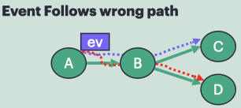

#### `infiniteLoop`

An event is supposed to move onward to D, but A, B, and C keep forwarding it in a cycle, creating an infinite loop.

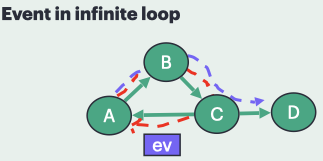

#### `unexpectedDisappear`

The intended path is A -> B -> C -> D, but the event vanishes at C because it is never forwarded onward.

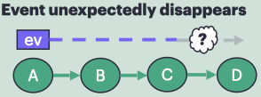

#### `missedDeadline`

D is expected to receive an event by a target time, but the A -> B -> C -> D path uses enough link latency that arrival is late; the goal is to locate which link is causing the slowdown.

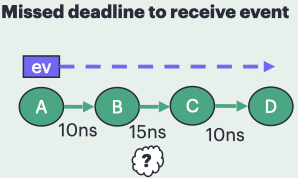

#### `outOfOrderReceipt`

E is intended to see `ev1` before `ev2`, but two events launched on different branches with different delays arrive in the opposite order.

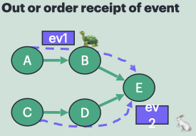

#### `duplicateSepTimes`

D is expected to receive a given event once, but A injects it at setup and again on later ticks, so repeated deliveries occur at different times.

#### `duplicateSameTime`

B is expected to receive a given event once, but A injects it twice at setup.

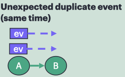

</dd> </dl> </dd> </dl> </dd> </dl> </dd> </dl> 

### Event Processing

<dl> <dd> <dl> <dd> <dl> <dd> <dl> <dd>

#### `broadcastStorm`

An event is broadcast too broadly from A to all six neighbors at startup.

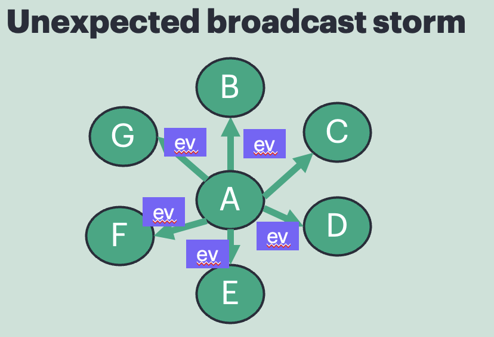

#### `badMerge`

C receives values from A and B and should merge them correctly, but it multiplies `10 * 2` instead of performing the intended add-style merge before sending the result to D.

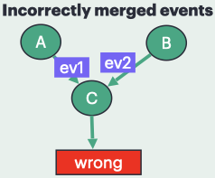

</dd> </dl> </dd> </dl> </dd> </dl> </dd> </dl>

### Incorrect Topology

<dl> <dd> <dl> <dd> <dl> <dd> <dl> <dd>

#### `missingLink`

The intended topology includes a B <-> C connection, but that link is absent.

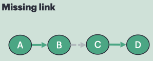

#### `wrongLink`

The intended topology is A -> B, but A is connected to C instead.

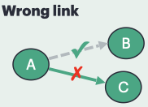

#### `unexpectedDuplicateLink`

A and B are linked twice instead of once.

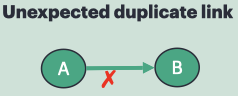

</dd> </dl> </dd> </dl> </dd> </dl> </dd> </dl>

### Deadlock

<dl> <dd> <dl> <dd> <dl> <dd> <dl> <dd>

#### `directDeadlock`

A waits for an event from B while B waits for an event from A, so neither side ever makes progress.

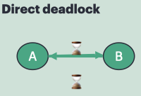

#### `indirectDeadlock`

This is the same wait cycle as direct deadlock, but with B sitting between A and C as a relay, so the blocked endpoints are separated by an intermediate component.

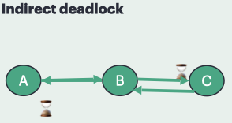

</dd> </dl> </dd> </dl> </dd> </dl> </dd> </dl>

### Fault Detection And Attribution

<dl> <dd> <dl> <dd> <dl> <dd> <dl> <dd>

#### `detectWhenComponentBecomesInvalid`

A starts valid and then flips its `valid` flag to false on a 40ns clock tick, modeling a component whose state becomes invalid during execution.

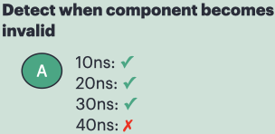

#### `badInvariantBetweenComponents`

A cross-component invariant is supposed to hold, but C follows a different update rule when it receives certain values, breaking the invariant.

#### `componentsLoseParity`

A and B are expected to stay in matching state over time, but their scripted values diverge at cycle 40 when they become 5 and 7.

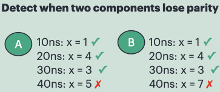

#### `divergedModels` (`divergedModels_A` and `divergedModels_B` substories)

This pair of stories represent separate models that are intended to retain parity with each other throughout execution, but at timestamp 40, `divergedModels_A` uses value 5 while `divergedModels_B` uses value 7.

#### `componentCausesSegfault`

Component C asserts once its clock reaches cycle 50 or later. The goal is to identify which component is responsible for the segfault and at what point in time the segfault occurs.

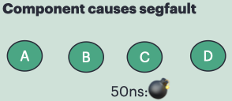

#### `badInitialState`

Four unconnected components are intended to initialize to the same state, but C starts with a different value than the others.

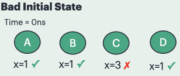

#### `badTerminatingState`

Similar to `badInitialState`, but the issue is that C changes to a different value before the simulation terminates. The goal is to identify which component has the bad value just prior to termination.

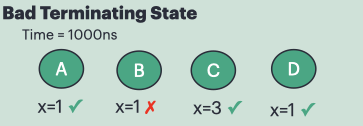

#### `findFirstToComplete`

The goal is to determine which component finishes first; the completion order is D first, then B, then C, then A.

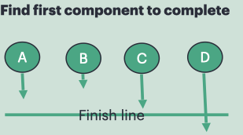

#### `determineWhatNotComplete`

The goal is to find components that never mark complete when the simulation ought to be done; here A, D, and E finish, while B and C never do.

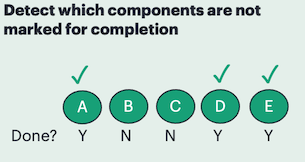

</dd> </dl> </dd> </dl> </dd> </dl> </dd> </dl>

### Load Imbalances

<dl> <dd> <dl> <dd> <dl> <dd> <dl> <dd>

#### `findEventHeavyComponent`

The goal is to identify which component processes the most events; in this four-node ring each component sends to its neighbor to the right.

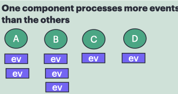

#### `findSlowProcessingComponent`

One component should be noticeably slower at processing than the others; all nodes send one event at startup to their right neighbor, but the event received by B takes much longer to process.

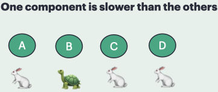

#### `findMemHeavyComponent`

The goal is to spot a component with unusually high memory usage; four unconnected components allocate different local buffer sizes, with B holding by far the largest payload.

#### `findMemHeavyEvent`

The goal is to spot an unusually large event; each node in a ring sends one rightward event with a payload buffer, and one of those messages is much larger than the others.

#### `findStarvedComponent`

The intended pattern is that all components should receive work, but one does not; in the current ring with uneven send quotas, C receives no events while the others do.

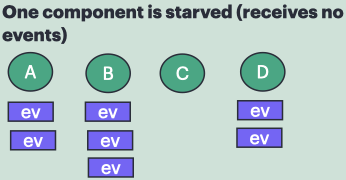

</dd> </dl> </dd> </dl> </dd> </dl> </dd> </dl>

## Adding a New Story

1. Add the story name to `NODE_STORY_LIST` in `Node.cpp`.
2. Add `setup_<story>` and `handleEvent_<story>` in `Node.h` and `Node.cpp`.
3. Add the story string to `VALID_STORIES` in `runStory.py`.
4. Add a `story_<story>()` function in `runStory.py`.

## Legacy Cases

Older standalone cases are stored in:

- `old/infiniteLoopTest/`
- `old/loadImbalance/`
