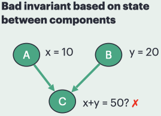
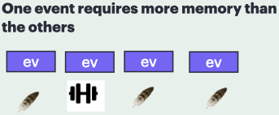
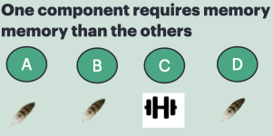

# SST Debug Stories

This repository contains a collection of debug use case examples for SST.  These are small, artificial examples illustrating situations that might occur in an SST simulation where a debugger could be used to detect or analyze behavior.  They are simple SST models with small topologies. Some examples demonstrate debugger features available today, but other cases might serve to inspire possible new debugger capabilities or companion tools.

## Overview

- All stories are built around a single SST component named `Node` (implemented in `Node.cpp` and `Node.h`).
- All stories are launched from a single SST simulation configuration script, `runStory.py`, which is passed the name of the particular story to run.
- Valid story names are [valid story section](#valid-stories).

## Files

- `doit`: convenience script to build the component library and launch SST interactively. The story to run is passed as an argument to the script and will be one of the stories [listed as a valid story below](#valid-stories).
- `Makefile`: builds and registers the componet library (`libdebugUseCases.so`).
- `runStory.py`: SST configuration script to run a given story (passed as an argument to the script).

## How to Run

From this directory:

1. Build and run in one step:

	 `./doit <storyName>`

2. Or run manually:

	 `make clean && make`

	 `sst --interactive-stop ./runStory.py <storyName>`

Where `<storyName>` is any valid story name from the [Valid Stories](#valid-stories) section.

## Valid Stories

- [`wrongPath`](#wrongpath)
- [`infiniteLoop`](#infiniteloop)
- [`unexpectedDisappear`](#unexpecteddisappear)
- [`missedDeadline`](#misseddeadline)
- [`outOfOrderReceipt`](#outoforderreceipt)
- [`duplicateSepTimes`](#duplicateseptimes)
- [`duplicateSameTime`](#duplicatesametime)
- [`badMerge`](#badmerge)
- [`missingLink`](#missinglink)
- [`wrongLink`](#wronglink)
- [`unexpectedDuplicateLink`](#unexpectedduplicatelink)
- [`directDeadlock`](#directdeadlock)
- [`indirectDeadlock`](#indirectdeadlock)
- [`detectWhenComponentBecomesInvalid`](#detectwhencomponentbecomesinvalid)
- [`badInvariantBetweenStates`](#badinvariantbetweenstates)
- [`componentsLoseParity`](#componentsloseparity)
- [diverged models: `divergedModels_A` and `divergedModels_B`](#divergedmodels-divergedmodels_a-and-divergedmodels_b-substories)
- [`componentCausesSegfault`](#componentcausessegfault)
- [`badInitialState`](#badinitialstate)
- [`badTerminatingState`](#badterminatingstate)
- [`findFirstToComplete`](#findfirsttocomplete)
- [`determineWhatNotComplete`](#determinewhatnotcomplete)
- [`findEventHeavyComponent`](#findeventheavycomponent)
- [`findSlowProcessingComponent`](#findslowprocessingcomponent)
- [`findMemIntensiveComponent`](#findmemintensivecomponent)
- [`findMemIntensiveEvent`](#findmemintensiveevent)
- [`findStarvedComponent`](#findstarvedcomponent)

## Story Details

### Event Tracing

#### `wrongPath`

We expect an event to originate at component A, go to component B, then C, but it ends up in D instead.

#### `infiniteLoop`

An event cycles between A, B, and C when the intent was for it to move from C to D.

#### `unexpectedDisappear`

We expect to see the event move from A to B to C to D, but somewhere along the path it is removed.

#### `missedDeadline`

We expected component D to receive an event by a specific time, but it arrived later. The goal is to identify where the slowdown occurred.

#### `outOfOrderReceipt`

Component E expects to receive `ev1` before `ev2` but receives them in the opposite order.

#### `duplicateSepTimes`

Component D expects to receive a given event once, but it receives it multiple times at different time steps.

#### `duplicateSameTime`

Component B expects a single event at a given time step but receives multiple.

### Event Processing And Topology

#### `badMerge`

Component C merges input it gets from A and B, but the merged result coming out of C is wrong.

#### `missingLink`

We expect B to be linked to C, but that link is missing.

#### `wrongLink`

We expect A to link to B, but instead it links to C.

#### `unexpectedDuplicateLink`

We expect A to link to B one time, but instead it links multiple times.

### Deadlock

#### `directDeadlock`

Component A waits for an event from B, while B waits for an event from A, so neither can proceed.

#### `indirectDeadlock`

This is the same situation as direct deadlock, but with additional components between the blocked endpoints.

### Fault Detection And Attribution

#### `detectWhenComponentBecomesInvalid`

At some point, the state of component A becomes invalid.

#### `badInvariantBetweenStates`

An invariant should hold across multiple components, but at some point it no longer does.

#### `componentsLoseParity`

We expect components A and B to always have matching state, but eventually they diverge.

#### `divergedModels` (`divergedModels_A` and `divergedModels_B` substories)

This story represents a pair of corresponding models whose states should match throughout the lifetime of the simulation.
To run each pair separately use the `divergedModels_A` and `divergedModels_B` substories.

#### `componentCausesSegfault`

Processing an event at a given component causes a segfault. The goal is to identify which component and event are responsible.

#### `badInitialState`

We want to inspect component state at time `0ns` to detect whether something is already wrong before execution proceeds.

#### `badTerminatingState`

We want to inspect component state near the end of the simulation to detect whether something is wrong at termination.

#### `findFirstToComplete`

We want to determine which component reaches completion first.

#### `determineWhatNotComplete`

We want to detect which components are not marked complete when the simulation should be done.

### Load Imbalances

#### `findEventHeavyComponent`

We want to determine which component processes the most events throughout a simulation.

#### `findSlowProcessingComponent`

One component takes longer to process its events than the others.

#### `findMemIntensiveComponent`

We expect all components to use roughly the same amount of memory, but one component is much more memory intensive.

#### `findMemIntensiveEvent`

We expect all events to use roughly the same amount of memory, but one event is much more memory intensive than the others.

#### `findStarvedComponent`

We expect all components to receive events, but one component never receives any.

## Adding a New Story

1. Add the story name to `NODE_STORY_LIST` in `Node.cpp`.
2. Add `setup_<story>` and `handleEvent_<story>` in `Node.h` and `Node.cpp`.
3. Add the story string to `VALID_STORIES` in `runStory.py`.
4. Add a `story_<story>()` function in `runStory.py`.

## Legacy Cases

Older standalone cases are stored in:

- `old/infiniteLoopTest/`
- `old/loadImbalance/`
