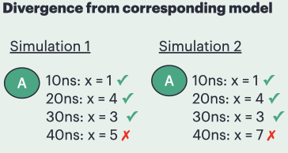

# divergedModels

## Situation

This story pair compares two models that are intended to retain parity throughout execution, but at timestamp 40 they diverge: `divergedModels_A` uses value 5 while `divergedModels_B` uses value 7.




## To try it out:

```
sst --interactive-start divergedModels_A.py
sst --interactive-start divergedModels_B.py
```

-or-

```
./doit divergedModels_A
./doit divergedModels_B
```

## Approach 1 -- examining and compare simulations at relevant points

In both simulations run:

```
# Let's look at the state of A at various points in the simulation
run 11ns
p A
run 10ns
p A
run 10ns
p A
run 10ns
p A
```

In the `divergedModels_A` substory this results in:

```
Entering interactive mode at time 0
Interactive start at 0
> run 11ns
Entering interactive mode at time 11000
Ran clock for 11000 sim cycles
> p A
A (SST::Component)
 component_state_ = 3 (SST::BaseComponent::ComponentState)
 my_info_ ()
 my_info_ (SST::ComponentInfo*)
 name = A (std::string)
 valid = 1 (bool)
 value = 1 (int)
 visited = 0 (int)
> run 10ns
Entering interactive mode at time 21000
Ran clock for 10000 sim cycles
> p A
A (SST::Component)
 component_state_ = 3 (SST::BaseComponent::ComponentState)
 my_info_ ()
 my_info_ (SST::ComponentInfo*)
 name = A (std::string)
 valid = 1 (bool)
 value = 4 (int)
 visited = 0 (int)
> run 10ns
Entering interactive mode at time 31000
Ran clock for 10000 sim cycles
> p A
A (SST::Component)
 component_state_ = 3 (SST::BaseComponent::ComponentState)
 my_info_ ()
 my_info_ (SST::ComponentInfo*)
 name = A (std::string)
 valid = 1 (bool)
 value = 3 (int)
 visited = 0 (int)
> run 10ns
Entering interactive mode at time 41000
Ran clock for 10000 sim cycles
> p A
A (SST::Component)
 component_state_ = 3 (SST::BaseComponent::ComponentState)
 my_info_ ()
 my_info_ (SST::ComponentInfo*)
 name = A (std::string)
 valid = 1 (bool)
 value = 5 (int)
 visited = 0 (int)
```

And in the `divergedModels_B` substory this results in:

```
Entering interactive mode at time 0
Interactive start at 0
> run 11ns
Entering interactive mode at time 11000
Ran clock for 11000 sim cycles
> p A
A (SST::Component)
 component_state_ = 3 (SST::BaseComponent::ComponentState)
 my_info_ ()
 my_info_ (SST::ComponentInfo*)
 name = A (std::string)
 valid = 1 (bool)
 value = 1 (int)
 visited = 0 (int)
> run 10ns
Entering interactive mode at time 21000
Ran clock for 10000 sim cycles
> p A
A (SST::Component)
 component_state_ = 3 (SST::BaseComponent::ComponentState)
 my_info_ ()
 my_info_ (SST::ComponentInfo*)
 name = A (std::string)
 valid = 1 (bool)
 value = 4 (int)
 visited = 0 (int)
> run 10ns
Entering interactive mode at time 31000
Ran clock for 10000 sim cycles
> p A
A (SST::Component)
 component_state_ = 3 (SST::BaseComponent::ComponentState)
 my_info_ ()
 my_info_ (SST::ComponentInfo*)
 name = A (std::string)
 valid = 1 (bool)
 value = 3 (int)
 visited = 0 (int)
> run 10ns
Entering interactive mode at time 41000
Ran clock for 10000 sim cycles
> p A
A (SST::Component)
 component_state_ = 3 (SST::BaseComponent::ComponentState)
 my_info_ ()
 my_info_ (SST::ComponentInfo*)
 name = A (std::string)
 valid = 1 (bool)
 value = 7 (int)
 visited = 0 (int)
```