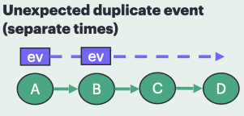

# duplicateSepTimes

## Situation

D is expected to receive a given event once, but A injects it at setup and again on later ticks, so repeated deliveries occur at different times.




## To try it out:

`sst --interactive-start duplicateSepTimes.py`

-or-

`./doit duplicateSepTimes`

## Approach 1 -- step and print

```
# First lets run the simulation to completion and then see how many times D has been visited:
run 10ns
p D

# - RESTART THE SIMULATION AND DEBUGGER -

# From here let's observe the events originate at A
p A         # We can see A starts with an event
run 2ns     # Step 2ns so A can process an event from the next timestep
p A         # And we can see A has made a duplicate event
```

I can run to completion and observe that **D** has received multiple events.

```
Entering interactive mode at time 0
Interactive start at 0
> run 10ns
Entering interactive mode at time 10000
Ran clock for 10000 sim cycles
> p D
D (SST::Component)
 component_state_ = 3 (SST::BaseComponent::ComponentState)
 my_info_ ()
 my_info_ (SST::ComponentInfo*)
 name = D (std::string)
 valid = 1 (bool)
 value = 0 (int)
 visited = 2 (int)
```

If I restart, I can switch to observing when the events are originally constructed from **A**.

```
Entering interactive mode at time 0
Interactive start at 0
> p A
A (SST::Component)
 component_state_ = 3 (SST::BaseComponent::ComponentState)
 my_info_ ()
 my_info_ (SST::ComponentInfo*)
 name = A (std::string)
 valid = 1 (bool)
 value = 0 (int)
 visited = 1 (int)
> run 2ns
Entering interactive mode at time 2000
Ran clock for 2000 sim cycles
> p A
A (SST::Component)
 component_state_ = 3 (SST::BaseComponent::ComponentState)
 my_info_ ()
 my_info_ (SST::ComponentInfo*)
 name = A (std::string)
 valid = 1 (bool)
 value = 0 (int)
 visited = 2 (int)
```

## Approach 1 -- tracepoints

It would probably be good to use tracepoints to see when events get built at A and received by D.

## Thoughts and wishlist items

### Many points overlap with the wrongPath use case

### Being able to break on receipt of an event would be useful
