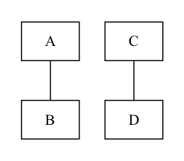

# missingLink

## Situation

The intended topology includes a B <-> C connection, but that link is absent.


## To try it out:

`sst --interactive-start missingLink.py`

-or-

`./doit missingLink`

## Approach 1 -- output DOT

I don't know of any real way to detect this using the SST debugger. You can, however, visualize the topology using SST directly:

```
sst --output-dot=missingLink.dot ./runStory.py -- missingLink
dot -Tpng missingLink.dot > missingLink.png
```

In a real use case the situation there would likely be some other bug (like a misrouted message) that would lead the user to suspect there could be a topology issue.



## Thoughts and wishlist items

### Discovery of neighbors

This point was also mentioned in the wrongPath case.

### Emit the topology from within the debugger